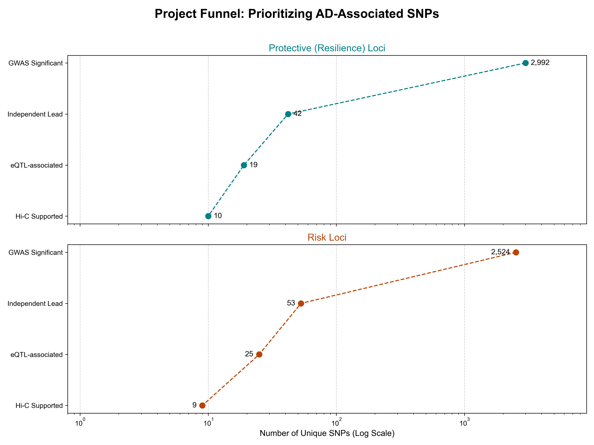
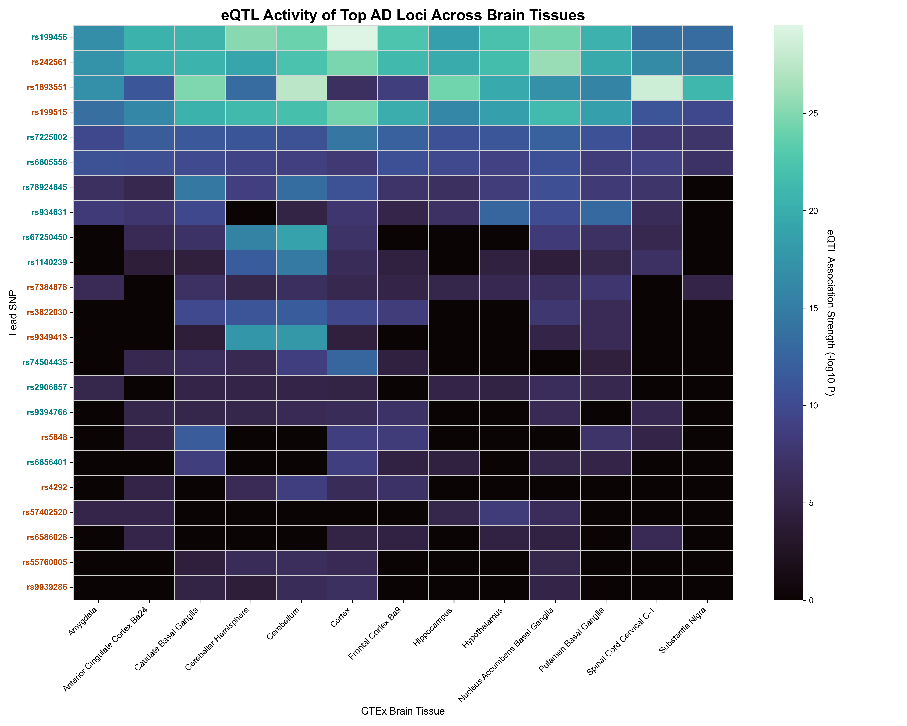
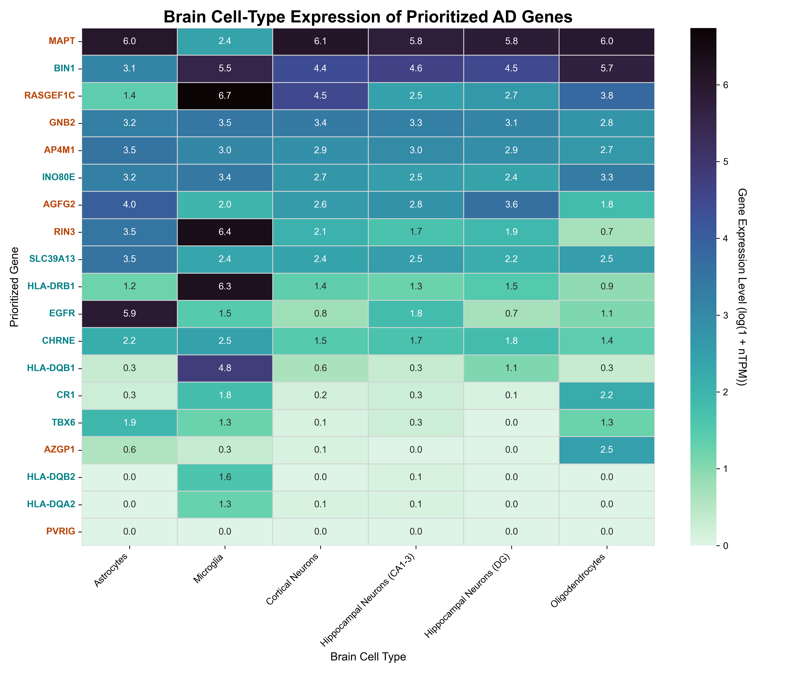
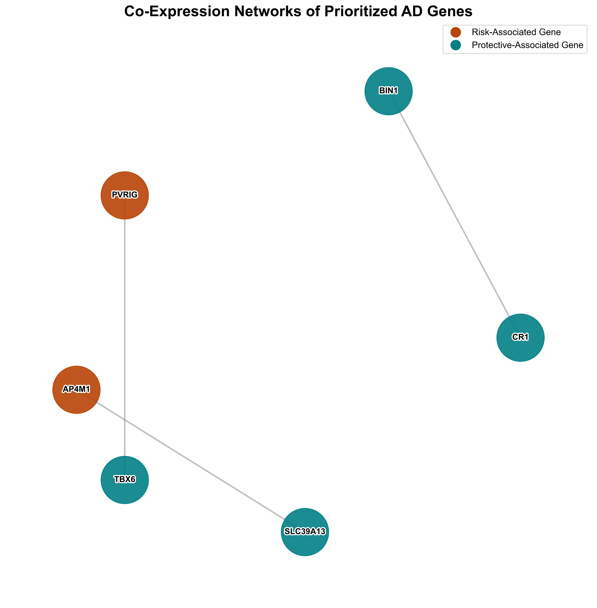
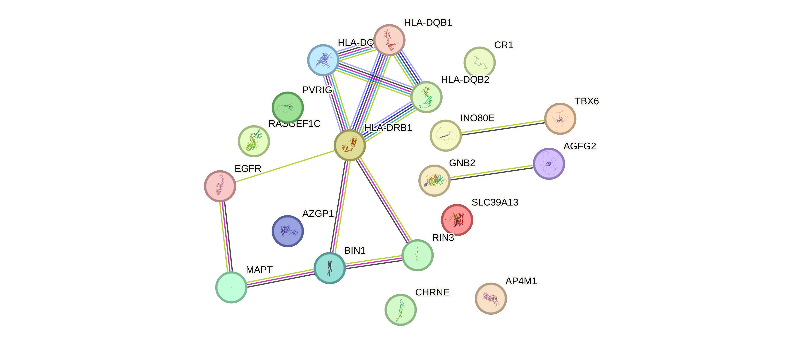
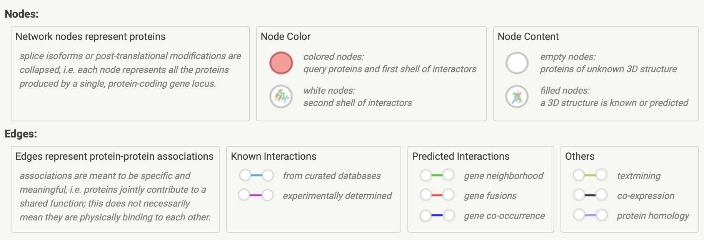
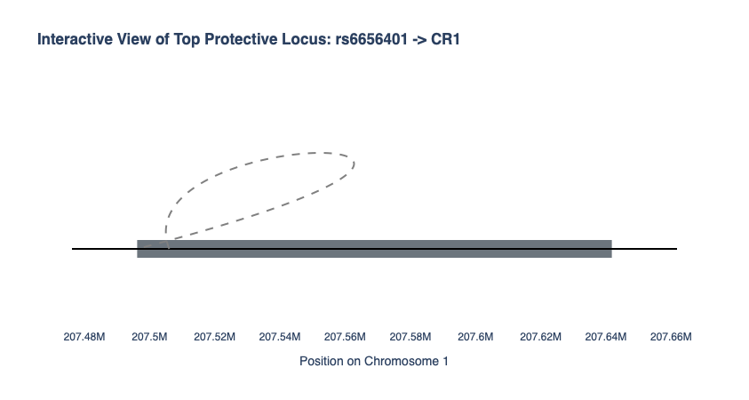
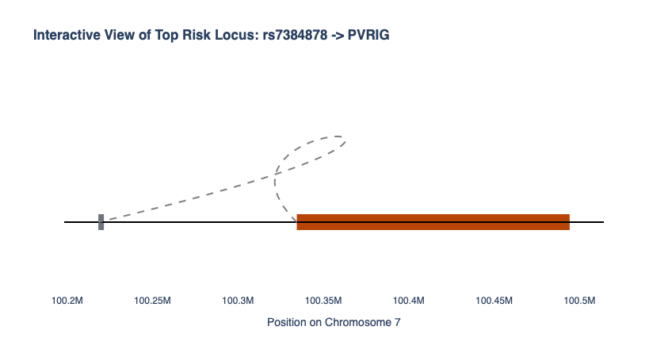

# Functional Prioritization of Alzheimer's Disease Loci through Integrative Genomics

## Abstract
This project integrates large-scale public data to move from statistically-associated genetic variants for Alzheimer's Disease (AD) to a prioritized list of functional candidates with plausible biological mechanisms. By combining Genome-Wide Association Study (GWAS) summary statistics with brain-specific expression Quantitative Trait Loci (eQTL) and chromatin interaction (Hi-C) data, this analysis identifies and characterizes high-confidence risk and protective loci, linking them to specific target genes, cellular contexts, and biological pathways relevant to AD pathology.

---

## Background & Significance
Genome-Wide Association Studies have identified hundreds of loci associated with Alzheimer's Disease, but most of these reside in non-coding regions of the genome, making their function difficult to interpret. It is hypothesized that these variants exert their effects by altering gene expression. This project leverages a multi-omics approach to test this hypothesis, providing mechanistic insight into how genetic risk translates to biological function, which is crucial for identifying novel therapeutic targets.

---

## Workflow & Methods
This project was executed via a comprehensive bioinformatics pipeline consisting of multiple analytical stages:

1.  **GWAS Locus Definition:** Processing of the Bellenguez et al. (2022) AD GWAS meta-analysis to identify genome-wide significant SNPs.
2.  **LD Clumping:** Application of distance-based clumping to distill thousands of correlated SNPs into a set of independent lead risk and protective loci.
3.  **eQTL Annotation:** Cross-referencing lead SNPs with the GTEx v8 database to identify variants that regulate gene expression (eQTLs) across 13 human brain tissues.
4.  **Functional Analysis:** Characterization of eQTLs by quantifying their sharing across brain tissues and by querying the Human Protein Atlas for gene function, expression clusters, and cell-type specificity.
5.  **3D Genome Integration:** Automated definition of LD blocks for all eQTL loci and intersection with brain-specific Hi-C data to identify physical chromatin loops connecting genetic loci to their target genes.
6.  **Network Analysis:** Use of the STRING database to determine if the final prioritized genes form a significantly interconnected protein-protein interaction network.

---

## Results

### The Prioritization Funnel
Our pipeline was designed to systematically narrow down thousands of initial GWAS signals to a small set of high-confidence functional candidates. We applied this strategy to both risk and protective loci, as shown by the filtering funnel below (Figure 1). This rigorous process reduced over 5,000 initial SNPs to our final set of prioritized loci with multi-omics support.

*__Figure 1: Project Funnel by Variant Type.__ The number of unique risk (orange) and protective (teal) SNPs remaining after each analytical filtering step. The x-axis is on a log scale.*

### Widespread vs. Specific Regulatory Effects
First, we examined the regulatory activity of our lead eQTL SNPs across all 13 GTEx brain tissues. The heatmap below (Figure 2) shows the significance of the eQTL association for each top SNP in each tissue. This reveals distinct patterns, with some SNPs having widespread effects across many tissues (e.g., rs199456), while others show more specific activity (e.g., rs55760005 in Oligodendrocytes-rich regions). The SNP labels are colored to distinguish between risk (orange) and protective (teal) variants.

*__Figure 2: eQTL Activity Patterns Across Brain Tissues.__ This heatmap displays the significance (-log10 P-value) of eQTL associations for prioritized SNPs (rows) across 13 GTEx brain tissues (columns). Darker colors indicate stronger statistical significance. SNP labels are colored to denote risk (orange) or protective (teal) associations, highlighting patterns of widespread versus tissue-specific regulatory activity.*

### Cellular Context of Prioritized Genes
To pinpoint the specific cellular context of our findings, we analyzed the expression of our prioritized target genes across major brain cell types using single-nuclei data from the Human Protein Atlas (Figure 3). This analysis revealed that a significant number of our candidate genes are highly expressed in glial cells, particularly Microglia (the brain's immune cells) and Oligodendrocytes. For example, the prioritized gene RASGEF1C shows strong expression in microglia. This provides a powerful, cell-type specific resolution to our findings, strongly reinforcing the hypothesis that dysregulation of glial cell biology, especially neuroinflammation, is a primary mechanism through which genetic factors influence Alzheimer's Disease.

*__Figure 3: Brain Cell-Type Expression of Prioritized Genes.__ This heatmap shows the relative expression (log-transformed nTPM) of prioritized genes (rows) across key brain cell types (columns). Gene labels are colored by their association type (Risk/Protective).*

### Functional Network Analysis
We next investigated whether the prioritized target genes were functionally related. A co-expression network analysis using data from the Human Protein Atlas revealed that the genes form several distinct modules (Figure 4a). This indicates that the genetics of AD likely impact coordinated biological networks, such as an immune-related module involving CR1 and BIN1, rather than just isolated genes. To validate this, a subsequent analysis with the STRING database confirmed that our prioritized genes are part of a significantly interconnected protein-protein interaction network (PPI enrichment p-value &lt; 0.0001), confirming our pipeline identified a set of functionally related proteins (Figure 4b).

*__Figure 4a: Co-Expression Network of Prioritized Genes.__ Genes (nodes) are connected if they belong to the same 'Brain Expression Cluster' from the Human Protein Atlas. This analysis reveals that our prioritized genes form several distinct functional modules rather than a single large network. Nodes are colored by their association type (Risk/Protective).*

*__Figure 4b: Protein-Protein Interaction (PPI) Network.__ Edges represent known and predicted interactions. The network is significantly enriched for such interactions (PPI p-value < 0.0001), confirming a high degree of functional connectivity.*

### Mechanistic Deep Dive on Top Loci
Finally, our pipeline culminated in a list of high-confidence SNP-eGene pairs supported by all three evidence types. The interactive plots below provide a deep dive into our top-ranked protective and risk loci, illustrating the full chain of evidence from the GWAS LD block, through the Hi-C chromatin loop, to the target gene.

](results/figures/06_interactive_protective_locus.html)

](results/figures/07_interactive_risk_locus.html)
*__Figure 5: Interactive views of the top prioritized loci.__ These figures integrate the GWAS LD block (colored bar), the target eGene (grey bar), and the supporting Hi-C interaction (dashed arc).*

---

## Discussion
The primary objective of this project was to move beyond the statistical associations of Genome-Wide Association Studies (GWAS) and identify a prioritized list of genetic variants with plausible, evidence-backed biological functions in Alzheimer's Disease (AD). By developing and executing a comprehensive, multi-omics pipeline, we successfully integrated GWAS statistics with brain-specific eQTL data and 3D chromatin interactions. This approach systematically filtered thousands of initial signals down to a core set of high-confidence risk and protective loci. The validity of our data-driven approach was confirmed by the successful prioritization of top-tier AD candidate genes, including BIN1, CR1, and MAPT (the gene encoding the Tau protein), which have explicit annotations for "Late-onset Alzheimers disease," "Tauopathy," and "Alzheimers disease biomarker measurement" in curated databases.

A dominant theme emerging from our findings is the central role of the neuro-immune system in the genetic etiology of AD. To investigate this, we analyzed our prioritized gene set in the STRING database, which revealed that the genes form a cohesive network with significantly more protein-protein interactions than expected by chance (PPI enrichment p-value < 0.0001). A subsequent gene set enrichment analysis defined the function of this network, showing a profound enrichment for Gene Ontology (GO) terms such as 'immune system process' and 'regulation of cytokine production'. This provides strong, data-driven confirmation that a primary mechanism through which genetic factors influence AD is by modulating the brain's inflammatory pathways, consistent with the literature (Leng et al., 2021).

Delving deeper into the network's properties, we found it was significantly enriched for proteins located at the 'plasma membrane' (GO Cellular Component analysis), which is consistent with a role in cell-surface signaling and how brain cells interact with their environment. Intriguingly, this same set of genes also showed a strong association with systemic autoimmune disorders in the DISEASES database. While this does not classify AD as a traditional autoimmune disease, it strongly suggests that its genetic architecture co-opts fundamental immune pathways that are dysregulated in autoimmunity, supporting emerging hypotheses in the field (Weaver, 2023).

These broad, systems-level themes are exemplified by the specific top-tier loci our pipeline prioritized. For instance, multiple prioritized genes belong to the HLA family (e.g., HLA-DRB1, HLA-DQA2), which is the human Major Histocompatibility Complex (MHC) and is central to a healthy immune response and antigen presentation. Furthermore, our top protective SNP (rs6656401) regulates CR1L, located directly beside the famous complement immune receptor CR1. This directly implicates the complement cascade—a core component of the innate immune system—in conferring resilience to Alzheimer's Disease.

Beyond the strong immune signature, our analysis also prioritized genes central to neuronal integrity and glial cell support. The successful identification of MAPT demonstrates the pipeline's ability to pinpoint core AD pathology. Furthermore, the prioritization of genes like AZGP1, which belongs to an "Oligodendrocytes - Mixed function" expression cluster, implicates another key glial cell type in AD. As oligodendrocytes are responsible for maintaining the brain's white matter, their dysfunction represents a distinct but complementary pathological axis captured by our analysis (Kedia et al., 2025). These findings show that our integrative approach was powerful enough to capture multiple biological systems perturbed by AD-associated variants.

This project has several strengths, including its comprehensive integration of multiple -omics layers, a fully automated and reproducible pipeline, and a novel dual focus on both risk and resilience loci. However, its limitations must be acknowledged. The analysis relied on data from bulk brain tissue, which can obscure effects specific to a single cell type. Furthermore, our computational findings generate strong, evidence-backed hypotheses—such as the link between the rs6656401 locus and the CR1 gene—that ultimately require targeted experimental validation.

The results of this project provide several clear avenues for future research. The tiered Polygenic Risk Scores (PRS) we defined are ready to be tested in a clinical cohort (like ADNI) to assess their power in predicting cognitive decline. Formal statistical colocalization analysis should be performed on our top SNP-eGene pairs to provide further evidence that the GWAS and eQTL signals share a single causal variant. Ultimately, the top candidates identified here represent a rich set of testable hypotheses for laboratory-based studies to definitively probe the molecular mechanisms of Alzheimer's Disease.

## Conclusion
In conclusion, this project successfully demonstrates the power of an integrative genomic approach to dissect the molecular mechanisms underlying genetic associations with Alzheimer's Disease. By overlaying GWAS, brain-specific eQTL, and 3D chromatin interaction data, we have moved beyond statistical signals to generate a ranked list of functional hypotheses. The standout finding is the deep characterization of our top protective locus, where the lead SNP rs6656401 was found to be a powerful eQTL for the long non-coding RNA CR1L. This regulatory relationship is physically substantiated by a chromatin loop connecting the variant's LD block to its target gene. Given this locus is located next to the critical CR1 immune receptor, our analysis provides a novel, testable hypothesis: that genetic resilience to Alzheimer's may be conferred by fine-tuning the neuro-immune response through these sophisticated non-coding regulatory elements. This specific result, along with the other prioritized risk and protective loci, delivers a rich set of high-confidence candidates for future experimental validation and therapeutic development.

---

## How to Reproduce
1.  Set up the conda environment using `conda env create -f environment.yml`.
2.  Activate the environment: `conda activate gwas`.
3.  Place all necessary raw data in the `data/` subdirectories as described.
4.  Run the scripts in the `scripts/` folder in numerical order from `01` to `11`.

---

## References
### Primary Data Sources & Analysis Tools
AD GWAS: Bellenguez, C., Küçükali, F., Jansen, I.E. et al. New insights into the genetic etiology of Alzheimer’s disease and related dementias. Nat Genet 54, 412–436 (2022). https://doi.org/10.1038/s41588-022-01024-z

GTEx: The GTEx Consortium. The GTEx Consortium atlas of genetic regulatory effects across human tissues. Science 369, 1318-1330 (2020). DOI: 10.1126/science.aaz1776

ENCODE (for Hi-C): The ENCODE Project Consortium. An integrated encyclopedia of DNA elements in the human genome. Nature 489, 57-74 (2012). https://doi.org/10.1038/nature11247

Human Protein Atlas: Uhlén M et al, Tissue-based map of the human proteome. Science 347, 1260419 (2015). DOI: 10.1126/science.1260419

STRING Database: Szklarczyk D et al. STRING v11: protein-protein association networks with increased coverage, supporting functional discovery in genome-wide experimental datasets. Nucleic Acids Res. 47, D607-D613 (2019). DOI: 10.1093/nar/gky1131

LDlink: Machiela MJ, Chanock SJ. LDlink: a web-based application for exploring population-specific haplotype structure and linking correlated alleles of possible functional variants. Bioinformatics. 2015 Nov 1;31(21):3555-7. doi: 10.1093/bioinformatics/btv402. Epub 2015 Jul 2. PMID: 26139635; PMCID: PMC4626747.

### Scientific Literature
Kedia, S., Simons, M. Oligodendrocytes in Alzheimer’s disease pathophysiology. Nat Neurosci 28, 446–456 (2025). https://doi.org/10.1038/s41593-025-01873-x

Leng, F., Edison, P. Neuroinflammation and microglial activation in Alzheimer disease: where do we go from here?. Nat Rev Neurol 17, 157–172 (2021). https://doi.org/10.1038/s41582-020-00435-y

Weaver D. F. (2023). Alzheimer's disease as an innate autoimmune disease (AD2): A new molecular paradigm. Alzheimer's & dementia : the journal of the Alzheimer's Association, 19(3), 1086–1098. https://doi.org/10.1002/alz.12789

### Key Software & Libraries
Pandas: McKinney, W. (2010). Data Structures for Statistical Computing in Python. In Proceedings of the 9th Python in Science Conference (pp. 56-61).

NumPy: Harris, C.R., Millman, K.J., van der Walt, S.J. et al. Array programming with NumPy. Nature 585, 357–362 (2020). https://doi.org/10.1038/s41586-020-2649-2

Matplotlib: Hunter, J. D. (2007). Matplotlib: A 2D Graphics Environment. Computing in Science & Engineering, 9(3), 90-95.

Seaborn: Waskom, M. L. (2021). Seaborn: statistical data visualization. Journal of Open Source Software, 6(60), 3021.

Plotly: Plotly Technologies Inc. (2015). Collaborative data science. Plotly Technologies Inc., Montreal, QC.

NetworkX: Hagberg, A. A., Schult, D. A., & Swart, P. J. (2008). Exploring network structure, dynamics, and function using NetworkX. In Proceedings of the 7th Python in Science Conference (pp. 11-15).

---
© 2025 Alicia Ronnie Gonsalves